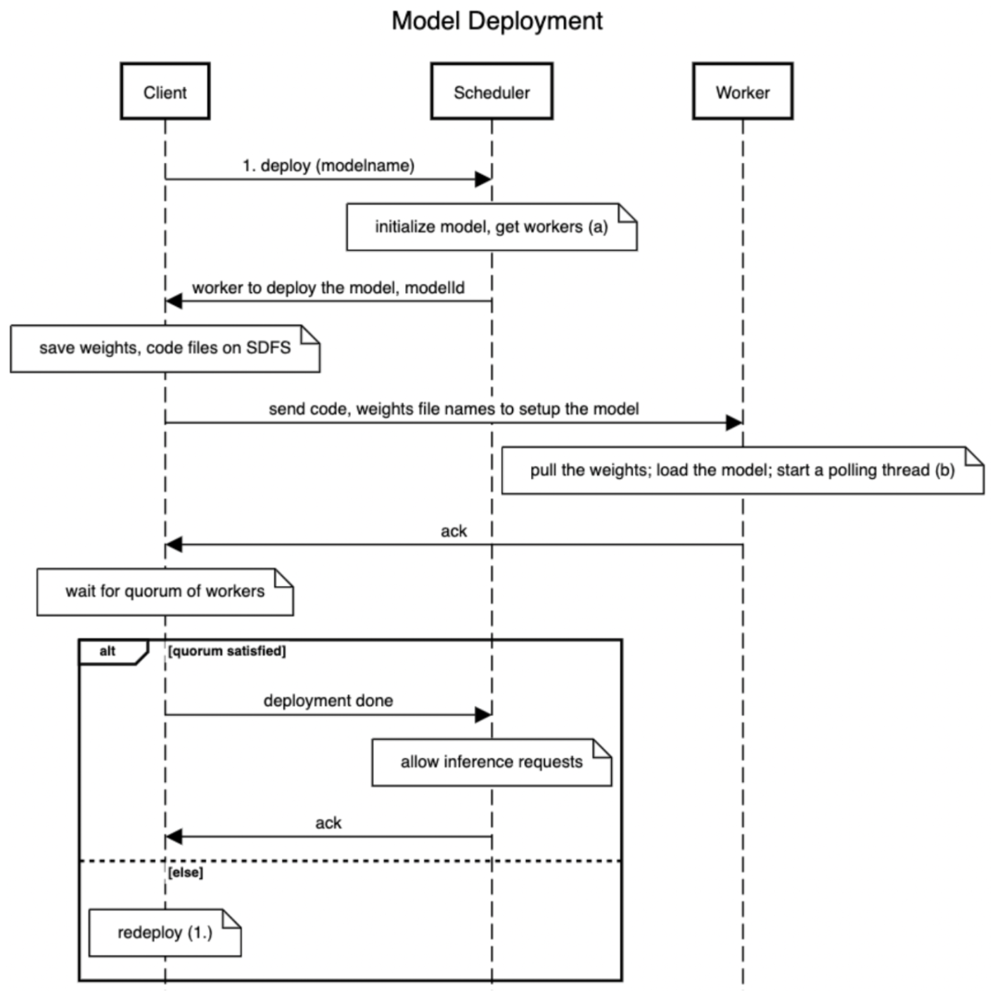
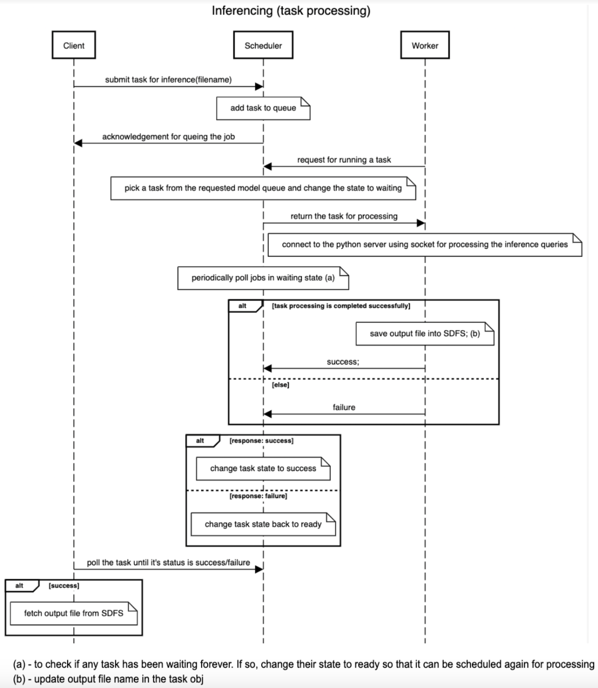
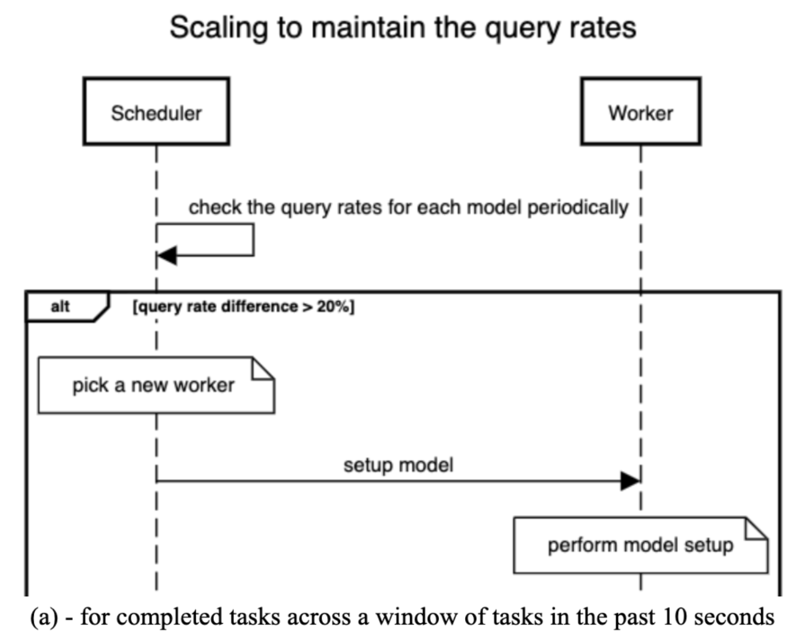
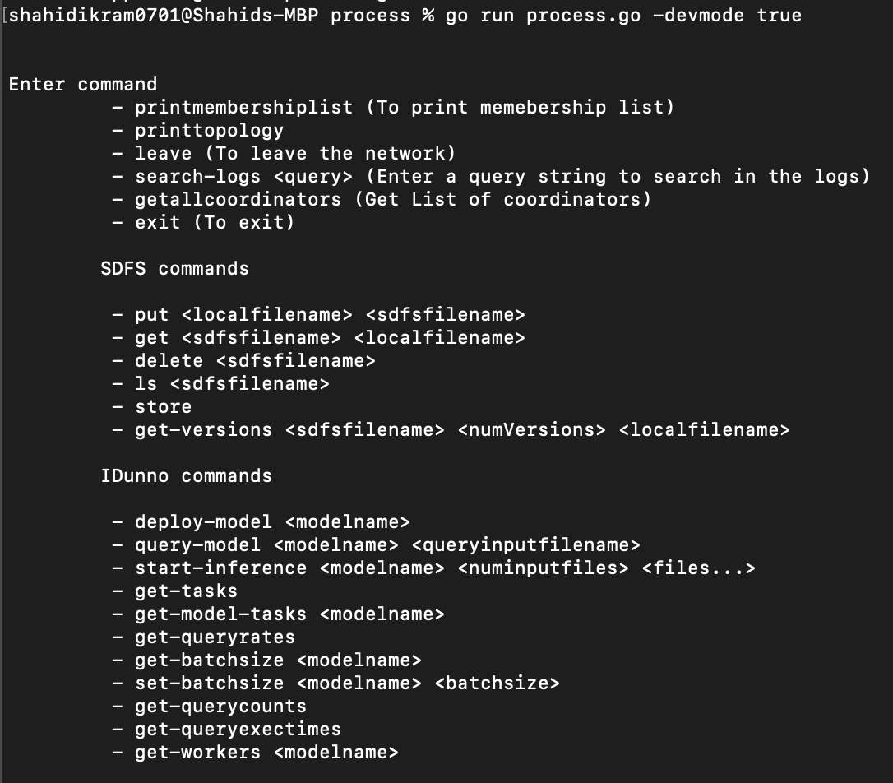

# IDunno: a Distributed Learning Cluster


## Description

This project is an implmentation of a distributed model serving system supporting deployment and inferencing across models. This system supports auto-scaling, to ensure that the query rates of the models stay within 20% of each other. This system is built on top of the simple versioned file system distributed across a cluster of nodes, arranged in a virtual ring topology, with a SWIM based failure detector protocol running underneath. 

## Components

> Distributed Log Querier

The client forwards the query to the coordinator process which then forwards the query request to all the processes in the ring. Each process on reciept of the request, process the query on the chunk of log file that resides on them and returns the result to the coordinator. The coordinator node assimilates the results from all the service processes and returns a response back to the client. 

> Distributed Group Membership

A SWIM style distributed group membership protocol runs underneath, where in each protocol period  (0.5s), each machine in the topology (ring shaped) pings one of the neighbors (predecessor, successor, super-successor) in a cyclic way, making sure it monitors all the 3 neighbors over three protocol periods. This design ensures that 3 simultaneous failures are detected. This design scales well for a large number of nodes because each process just monitors 3 of its neighbors and sends a copy of the membership list to them instead of flooding the whole topology with the list which could lead to increased network congestion as in all-to-all heartbeat failure detection. We also piggy back the marshaled membership list with every “pong” that the node sends out ensuring gossip style membership list dissemination. 


The state of each of the entries in the membership list goes from “Active” -> “Suspicious” -> “Failed” -> “Delete”, after which the entry for that process is deleted. If the process doesn’t respond to the UDP ping the process is marked “Suspicious” and if it remains suspicious for T_FAIL = 1s, the state is updated to “Failed”. Once the process is marked as failed, we wait for another T_DELETE = 1s to mark the process state as “Delete” after which the process will be removed from the list. This ensures that a failed process will be removed from the list in well under 3s.


> Distributed File System

This simple versioned file system file system design is inspired by certain design propositions found interesting from the Google File System paper, its implementation by Yahoo, open sourced as the Hadoop File System; and Corfu. The system supports total ordering of operations, and is tolerant up to three simultaneous machine failures with re-replication to ensure availability of data under the constraints. The writes and reads to the file system are agreed upon by a quorum of nodes in the replica set.

A general view of the high level architecture of the system is presented below.


>>Components of the SDFS

`Coordinator Replicated State Machine`
-  Stores metadata information of the files in the system
- Coordinates all the file system operations

`Data Nodes`
- Stores the actual file data

### Key Features:
- Total ordering of operations
- Data Replication and Quorum
- Re-Replication (Replica Recovery) in case of node failures
- Versioned File system - Stores all the versions of a file

> Distributed Learning System

The system supports model deployments and inferencing with support for autoscaling when the difference in query rates between any two models are >= 20%

Roles:
Client - Deploys the models and runs inferences on the models. Each inference task run is a batch of queries. 
Scheduler - Orchestrates the execution of the jobs.
Workers - Run the models and perform inference. 

The system supports any number of model deployments and tasks are separated on client basis, ie. a client is agnostic to other client’s tasks executing in the system.

`Model deployment`

The client submits a model-deployment request to the scheduler. The scheduler allocates and assigns a set of workers for the model. The client then pushes the code file and weights of the model into the distributed file system, and directs the workers assigned to fetch the necessary files from the filesystem and set up the model. Until the model is successfully deployed, as indicated by the workers, the model state is held as “Undeployed”, and no inference queries are taken in this state. Once the client gets a successful response from all the workers, it intimates this to the scheduler which then marks the model as “Deployed” and is open to take inferencing jobs on the model.



`Model Inferencing`

After the successful completion of the model deployment on workers, clients can send multiple tasks to the scheduler. A task is a batch of inference queries. The scheduler adds the task to the queue. 

States of a task:
Ready =>  Ready for the workers to pick up the task from the queue)
Waiting => Being processed by a worker
Success => Task is successfully completed

The workers poll the scheduler for tasks corresponding to a model. The scheduler picks a “Ready” task and assigns it to the worker and changes its state to “Waiting”. Once the task is completed successfully, the worker saves the o/p file onto SDFS and returns the name of the output file to the scheduler if the task is successfully completed. The scheduler then appropriately sets the state of the task. 

The client can see all the output files for each 
task and fetch the output file needed from the SDFS asynchronously



`Model Scaling`

Every worker periodically polls the scheduler in the background, looking if there are any new models  that are deployed. If there is a new model in the system, the worker prefetches the weights and  the code file for the new model from SDFS and keeps it handy in case scaling of the model is to be done. The model is not  run yet.

The scheduler periodically polls the query-rates for all the models by checking the tasks that were processed in a past window of time currently set to 10 seconds. If the query rate difference exceeds 20%, then scale up is to be done. In this case a new worker is allocated for the lagging model. A request is sent to the new worker to set up the model. If that worker had already pre-fetched the model file and weights from the SDFS, then it runs the model and intimates the scheduler of a successful setup. Else it pulls the weights and code that is needed and then runs the model. The new worker then starts polling the scheduler for tasks of the model 



## Running the code

### Setting up the code
```
$ git clone https://gitlab.engr.illinois.edu/shahidi3/cs425_mp1_distributedlogquerier.git
$ mkdir logs (should contain log pertaining to the node)
$ cd cs425_mp1_distributedlogquerier
$ go mod download
```

### Running the client
```
[optional] To delete the previous logs
$ ./removelogs.sh 

Starting the introducer
$ ./run_introducer.sh

Starting a process
$ ./run_process.sh
```




## Authors

Lavanya Ramkumar\
Shahid Ikram