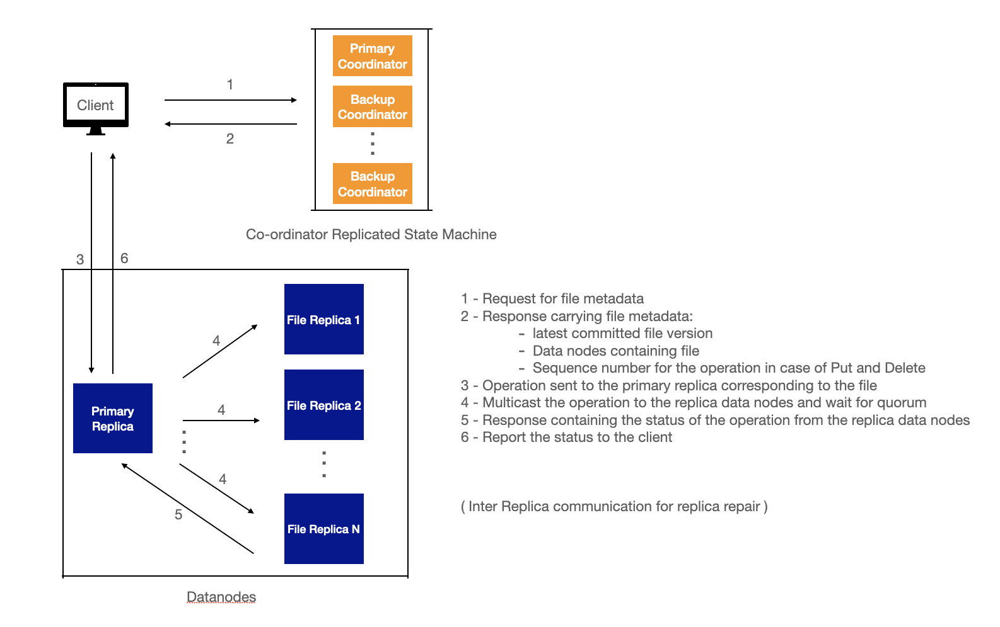
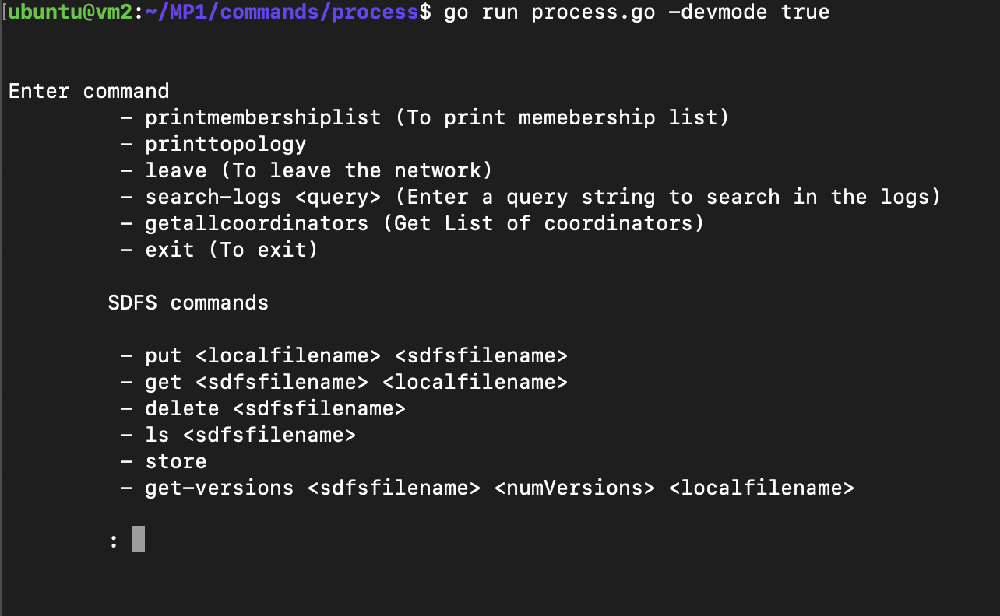

# [Group 37] Simple Distributed File System


## Description
This project is an implmentation of a simple versioned file system distributed across a cluster of nodes, arranged in a virtual ring topology, with a SWIM based failure detector protocol running underneath. The system supports total ordering of operations, and is tolerant up to three simultaneous machine failures with re-replication to ensure availability of data under the constraints. The writes and reads to the file system are agreed upon by a quorum of nodes in the replica set.


## Components

> Distributed Log Querier

The client forwards the query to the coordinator process which then forwards the query request to all the processes in the ring. Each process on reciept of the request, process the query on the chunk of log file that resides on them and returns the result to the coordinator. The coordinator node assimilates the results from all the service processes and returns a response back to the client. 

> Distributed Group Membership

A SWIM style distributed group membership protocol runs underneath, where in each protocol period  (0.5s), each machine in the topology (ring shaped) pings one of the neighbors (predecessor, successor, super-successor) in a cyclic way, making sure it monitors all the 3 neighbors over three protocol periods. This design ensures that 3 simultaneous failures are detected. This design scales well for a large number of nodes because each process just monitors 3 of its neighbors and sends a copy of the membership list to them instead of flooding the whole topology with the list which could lead to increased network congestion as in all-to-all heartbeat failure detection. We also piggy back the marshaled membership list with every “pong” that the node sends out ensuring gossip style membership list dissemination. 


The state of each of the entries in the membership list goes from “Active” -> “Suspicious” -> “Failed” -> “Delete”, after which the entry for that process is deleted. If the process doesn’t respond to the UDP ping the process is marked “Suspicious” and if it remains suspicious for T_FAIL = 1s, the state is updated to “Failed”. Once the process is marked as failed, we wait for another T_DELETE = 1s to mark the process state as “Delete” after which the process will be removed from the list. This ensures that a failed process will be removed from the list in well under 3s.


> Distributed File System

The file system design is inspired by certain design propositions found interesting from the Google File System paper, its implementation by Yahoo, open sourced as the Hadoop File System; and Corfu. A general view of the high level architecture of the system is presented below.




>>Components of the SDFS

`Coordinator Replicated State Machine`
-  Stores metadata information of the files in the system
- Coordinates all the file system operations

`Data Nodes`
- Stores the actual file data

### Key Features:
- Total ordering of operations
- Data Replication and Quorum
- Re-Replication (Replica Recovery) in case of node failures
- Versioned File system - Stores all the versions of a file


## Running the code

### Setting up the code
```
$ git clone https://gitlab.engr.illinois.edu/shahidi3/cs425_mp1_distributedlogquerier.git
$ mkdir logs (should contain log pertaining to the node)
$ cd cs425_mp1_distributedlogquerier
$ go mod download
```

### Running the client
```
[optional] To delete the previous logs
$ ./removelogs.sh 

Starting the introducer
$ ./run_introducer.sh

Starting a process
$ ./run_process.sh
```



## Authors

Lavanya Ramkumar\
Shahid Ikram